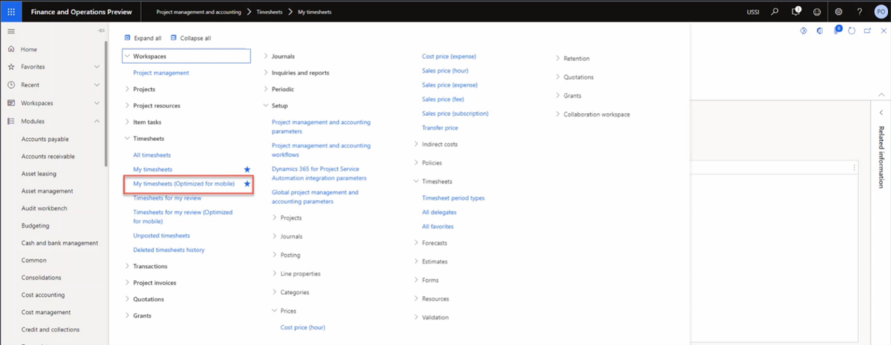

---
demo:
    title: '데모 3: 프로젝트 비용 살펴보기'
    module: '모듈 5: Microsoft Dynamics 365 Project Operations의 기본 사항 파악'
---

## 데모 3 - 프로젝트 비용 살펴보기

이 데모에서는 Contoso Consulting 프로젝트 비용을 청구하는 데 사용할 시간 및 경비 항목을 만드는 과정을 단계별로 진행합니다. 웹 및 모바일 표시용으로 최적화된 형식의 항목을 살펴본 후, 워크플로를 사용하여 승인 프로세스를 관리하는 방법을 알아봅니다.

1. **Dynamics 365 for Finance and Operations**의 탐색 창에서 **모듈 > 프로젝트 관리 및 회계 > 작업표 > 내 작업표(모바일에 최적화)**를 선택합니다.  
    이 데모 작성 시에는 모바일 디바이스를 사용하지 않았지만, **내 작업표(모바일에 최적화)** 옵션을 선택하면 모바일용 양식을 확인할 수 있습니다.

      

    Microsoft 비즈니스 애플리케이션에서만 제공되는 차별화된 기능인 이 최적화 기능을 활용하는 경우 최소한의 학습만 진행하면 웹 버전과 모바일 버전을 모두 활용할 수 있습니다.

1. 오른쪽 위의 회사 선택기에서 연결할 법인이 **USSI**인지 확인합니다. 법인이 **USSI**가 아니면 USSI로 변경합니다.

1. **내 작업표** 페이지에서 **새로 만들기**를 선택합니다.  
    이제 구성된 설정을 기준으로 새 작업표를 만들겠습니다.

1. **새 작업표** 창에서 **날짜** 상자를 가리킵니다.  
    입력하는 날짜에 따라 작업표 기간이 결정됩니다.

1. **즐겨찾기에서 만들기**를 가리킵니다.  
    즐겨찾기를 저장해 두었다면 즐겨찾기에서 만들기를 선택하여 시간을 절약할 수 있습니다.

1. 선택을 완료한 후 **확인**을 선택합니다.

1. **내 작업표 세부 정보** 페이지에서 **새로 만들기 +** 아이콘을 선택합니다.

1. **새 작업표 행** 창에서 **법인** 상자를 가리킵니다.  
    고객, 프로젝트, 범주, 행 속성, 세금 매개 변수 등의 세부 정보를 입력할 수 있는 새 작업표 행이 열립니다. 조직 내 다른 회사 대신 시간을 입력하는 경우에는 다른 법인을 선택할 수도 있습니다.

1. **프로젝트 ID** 메뉴를 선택합니다.

1. **Contoso Consulting** 프로젝트 등 사용 가능한 프로젝트 중 하나를 선택합니다.

1. 선택을 완료한 후 **확인**을 선택합니다.  
    모바일에 최적화된 시간 입력용 화면이 열립니다. 그러면 각 프로젝트 날짜 및 범주(여기서는 **서비스**)의 시간 예약을 시작할 수 있습니다.

1. **시간 입력** 페이지의 **월** 상자에 **8**을 입력합니다.  
    이러한 방법으로 하루 동안의 작업 시간을 입력합니다.

    

1. **내부 설명** 상자에 설명을 추가합니다. 예를 들어 **새 자전거 관련 설명** 등을 입력할 수 있습니다.  
    모든 당사자가 로깅하는 시간의 특성을 파악할 수 있도록 프로젝트에 내부 및 외부 설명을 입력할 수도 있습니다.

1. **외부 설명** 상자에 설명을 추가합니다. 예를 들어 **자전거 체인 조정 및 전륜 맞춤** 등을 입력할 수 있습니다.

1. 탐색 모음에서 **저장**을 선택합니다.

1. 왼쪽 탐색 메뉴의 **작업표** 아래에서 **내 작업표**를 선택합니다.

1. **내 작업표** 페이지에서 앞에서 만든 시간 항목을 선택합니다.

1. **작업표** 탭에서 범주 열을 가리킵니다.  
    모바일 디바이스에서 컴퓨터로 돌아와 웹 작업표 양식 내에서 시간을 검토한다고 가정해 보겠습니다. 범주, 시간 등의 동일한 정보를 웹에서도 확인할 수 있습니다.

1. **행 세부 정보** 아래에서 **내부 설명** 및 **외부 설명**을 가리킵니다.  
    그러면 앞에서 입력한 설명도 검토할 수 있습니다. 같은 정보가 표시되기는 하지만 레이아웃 서식은 약간 다릅니다. 이 서식은 최종 검토에 사용되는 경우가 많습니다. 작업자들이 더욱 쉽게 시간을 검토하고 유효성을 검사할 수 있기 때문입니다. 특히 작업자 한 명이 여러 프로젝트나 범주에 할당되어 있는 경우에는 이 서식이 더욱 유용합니다.

1. 탐색 모음에서 **워크플로** 탭을 선택합니다.  
    작업표에 문제가 없으면 제출할 수 있습니다. 필요한 승인 과정은 각 조직에서 회사 정책에 따라 구현 단계에서 결정합니다.

1. **작업표 검토 워크플로** 창에서 **제출**을 선택합니다.

1. **작업표 검토 워크플로 - 제출** 창에서 설명을 더 추가합니다.

1. **제출**을 선택합니다.

1. **시간 거래** 페이지로 이동합니다. **시간 거래** 탭이 회색으로 표시되어 있으면 **내 작업표 페이지**로 이동하여 앞에서 만든 작업표를 선택합니다.

1. **시간 거래** 페이지에서 페이지의 내용을 검토합니다.  
    작업표가 승인되면 결과가 게시되며, 시간 거래 페이지에 해당 내용이 표시됩니다. 법인, 프로젝트, 범주, 시간 등의 모든 관련 정보를 확인할 수 있으며 여기서는 비용 가격 및 판매 가격도 확인할 수 있습니다.  

그런 다음에는 바우처 거래로 드릴다운할 수 있습니다.

1. 탐색 모음에서 **바우처**를 선택합니다.

1. **바우처 거래** 페이지에서 **원장 계정** 및 **계정 이름** 섹션을 가리킵니다.  
    이 섹션에서 총계정원장에 작업표가 반영되는 방식과 사용되는 계정을 확인할 수 있습니다.  

이제 동일한 Contoso Consulting 프로젝트용 경비 항목을 만들어 보겠습니다.

1. 탐색 창에서 **모듈 > 경비 관리 > 내 경비 > 경비 보고서**를 선택합니다.

1. **경비 관리** 페이지의 **보고서** 탭에서 **+ 새 경비 보고서**를 선택합니다.

1. **새 경비 보고서** 창의 **용도** 상자에 제목을 입력합니다. **Contoso – Feb2021** 등을 입력할 수 있습니다.

1. **확인**을 선택합니다.

1. **경비** 페이지에서 **+ 새 경비**를 선택합니다.  
새 경비 행이 나타납니다.

1. **경비 범주** 열의 **범주 **드롭다운 메뉴에서 **연료**를 선택합니다.  
여기서 새 경비와 해당 세부 정보를 입력할 수 있습니다.

1. **거래 금액** 열에 **25.00**을 입력합니다.

1. **통화** 열에서 **USD**를 선택합니다.

1. **거래 날짜** 열에서 날짜를 선택합니다. **2021/2/1** 등을 선택할 수 있습니다.  
    세부 정보를 모두 입력했으므로 경비를 저장할 수 있습니다.

1. **저장**을 선택합니다.

1. 왼쪽 탐색 메뉴의 **작업 영역** 아래에서 **경비 관리**를 선택합니다.

1. **경비 관리** 페이지에서, 방금 만든 경비 보고서를 선택합니다.

1. **경비 보고서** 페이지에서 **프로젝트 ID** 상자를 선택하고 **00000093 Contoso Consulting**을 선택합니다.  

다음으로는 Consoto Consulting 프로젝트에 연료비를 청구할 것임을 지정하고 경비 관련 추가 정보를 입력할 수 있습니다.

1. **추가 정보** 상자를 가리킵니다.

1. 화면 오른쪽 아래에서 **저장 및 계속**을 선택합니다.

1. 화면 오른쪽에서 **제출**을 선택합니다.

1. **설명** 상자에 설명을 더 추가합니다.

1. **제출**을 선택합니다.

1. **경비 관리** 페이지에서 **승인 상태** 열을 가리킵니다.  
    이제 출장 정책 및 경비 승인 흐름이 활성화됩니다. 비용이 게시되어 Contoso Consulting 프로젝트에 적용되었으며, 해당 비용을 청구할 수 있는 경우 나중에 송장 발행용으로 사용할 수 있습니다.

이 데모에서는 Contoso Consulting 프로젝트 비용을 청구하는 데 사용할 시간 및 경비 항목을 처리했습니다. 그리고 웹 및 모바일 형식의 샘플을 확인했으며, 워크플로를 사용하여 USSI 조직에 필요한 승인 과정을 관리하는 방법을 살펴보았습니다.
